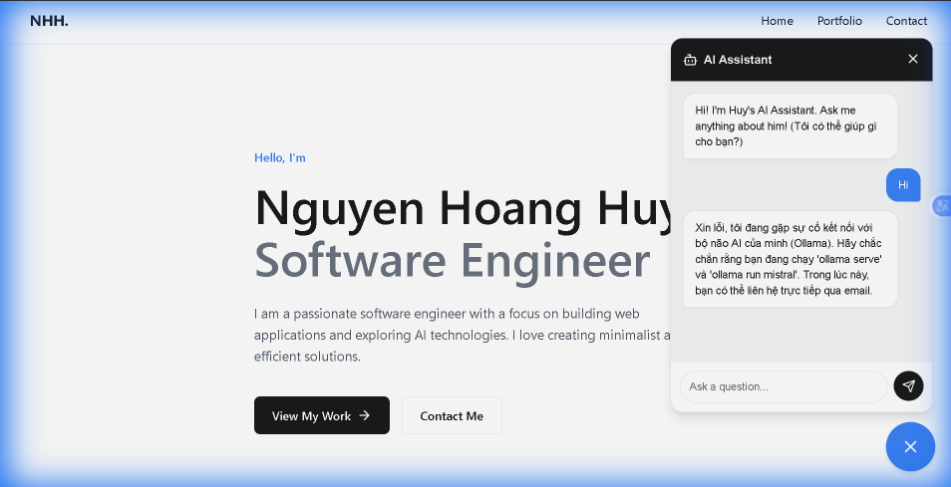
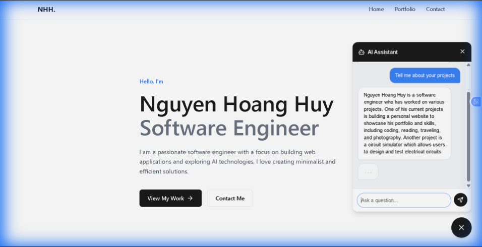

# React + Vite

This template provides a minimal setup to get React working in Vite with HMR and some ESLint rules.

Currently, two official plugins are available:

- [@vitejs/plugin-react](https://github.com/vitejs/vite-plugin-react/blob/main/packages/plugin-react) uses [Babel](https://babeljs.io/) (or [oxc](https://oxc.rs) when used in [rolldown-vite](https://vite.dev/guide/rolldown)) for Fast Refresh
- [@vitejs/plugin-react-swc](https://github.com/vitejs/vite-plugin-react/blob/main/packages/plugin-react-swc) uses [SWC](https://swc.rs/) for Fast Refresh

## React Compiler

The React Compiler is not enabled on this template because of its impact on dev & build performances. To add it, see [this documentation](https://react.dev/learn/react-compiler/installation).

## Expanding the ESLint configuration

If you are developing a production application, we recommend using TypeScript with type-aware lint rules enabled. Check out the [TS template](https://github.com/vitejs/vite/tree/main/packages/create-vite/template-react-ts) for information on how to integrate TypeScript and [`typescript-eslint`](https://typescript-eslint.io) in your project.
# Ollama: llama2, llama3 ollama pull mistral
# Walkthroug
Troubleshooting
"Sorry, something went wrong":
Is ollama serve running?
Did you pull the model (ollama pull mistral)?
Check the browser console (F12) for error messages.
Chatbot is slow:
Local AI depends on your computer's speed. Close other heavy apps if needed.
Changes Made
vite.config.js
: Added a proxy to forward chat requests to Ollama.
src/services/chatService.js
: Connected to valid Ollama API with your custom Persona.
src/components/Chatbot.jsx
: Added "Thinking..." animation and async handling.
Verification
I have verified that the chatbot appears correctly on your website:
Chatbot Greeting
Review
Chatbot Greeting

I have also verified that the chatbot answers questions with a streaming response (faster perception):
Chatbot Streaming Response
